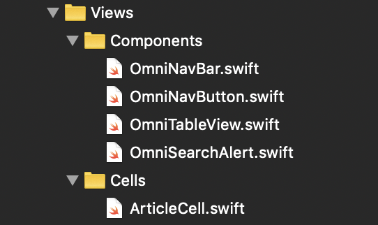

# Omni LITE

## Short description

Application Omni LITE is based on API available at http://omni-content.omni.news.

## Detailed description

Application is simple article & topic presenter. Based on http://omni-content.omni.news. 

Tested on:
 1. iPhone Xr (Simulator)
 2. iPhone Xs Max (Simulator)
 2. iPhone 8 Plus (Physical Device)

* Main features:
1. Option to find article by query.
2. Display list of articles that was fetched from server.
3. Display details of article from articles list.
4. It only use _Storyboard_ for launchScreen.
5. Views are generated in code.
6. Implements dependency injection stored in _initDependencies()_ function in _AppDelegate.swift_

* Views:

    **Articles List**
    
    
    
    List contains navigation bar with button that gives possibility to search for articles for user typed query. It also has table to display all articles. As default it shows articles for query = ""
    
    **Article Search**
    
    
    
    Article search its popup view that gives possibility to pass query and fetch articles connected with that query.
    
    **Article Details**
    
    
    
    Article details display details of article. It can be reached from Articles list by selecting cell with specific article.

* Project structure:

### Extensions:

**Description:**

Folder contains every swift _extension_.
    
**Files:**
    
_UIBarButtonItemExtension.swift_ - extension contains everything that can be connected with **UIBarButtonItem** from _UIKit_ 

### Views: 

**Description:**

Folder contains two folders: 

* Components: 

    Contains _UIKit_ custom components, modified to fit more to project requirements
    
    **Files:**
        
    _OmniNavBar.swift_ - modified **UINavigationBar** class with custom constructors which at default create **UINavigationItem** and add it to **OmniNavBar**
    
    _OmniNavButton.swift_ - modified **UIBarButtonItem** class with custom constructors which creates custom views of **UIBarButtonItem**.**OmniNavButton** need to be added to **OmniNavBar**.
    
    _OmniTableView.swift_ - modified **UITableView** class with implemented **UITableViewDelegate** and **UITableViewDataSource** classes.
    
    __OmniSearchAlert.swift__ - modified **UIAlertController** with custom buttons and **UITextField** to pass searched query.

* Cells:

    Contains custom **UITableViewCell** classes with custom _UIKit_ classes added.
    
    **Files:**
    
    _ArticleCell.swift_ - custom cell for article displaying contains: _UIView_, _UILabel_, _UIImageView_.
    
### Protocols

**Description**

Folder contains every swift _protocol_.
    
**Files:**
    
_ApiProtocol.swift_ - protocol that contains what have to be implemented to **API** class

### Http

**Description:**

Folder contains two folders:

* Base:
    
    Base folder contains Http classes that are inherited by classes included in _Custom_ folder. 
    
    **Files:**
    
    _API.swift_ - class contains base of http requests. It also implements _ApiProtocol_ protocol

* Custom:

    Custom folder contains Http classes for specific actions more detailed. Every Custom class inherits class from Base folder.
    
    **Files:**
    
    _Omni.swift_ - class contains HTTP Requests connected with Omni API. It also is responsible to sort data from JSONs to Models or Swift data types.
    
### Models

**Description:**

Folder contains Models that are containers of data for example data fetched from server.

**Files:**

_Article.swift_ - struct that sorts and store data fetched from _search/_ function from _http://omni-content.omni.news_ API.

### AddOns

**Description:**

Folder contains every data that doesn't fits requirements of any other folder.

**Files:**

_Info.plist_ - Information Property List that are required for iOS Projects. Here are stored information about project.

_Omni_Lite.xcdatamodeld_ - It is file that is used by CoreData framework.

_Statics.swift_ - It is a swift struct that contains static values like strings or integers that can be reused in many situations.

_uiPreferences.swift_ - It is a class that contains UI options like screen size.

### Storyboards

**Description:**

Folder contains _storyboard_ files but like it was mention in main features application only uses _LaunchScreen.storyboard_

**Files:**

_LaunchScreen.storyboard_ - Launch Screen of application

_Main.storyboard_ - Main storyboard of application. This application doesn't use it at all because all view are generated in swift files.

### Controllers

**Description:**

Folder contains two folders:

* Base:
    
    Base folder contains Controller classes that are inherited by classes included in _Custom_ folder. Base Controllers are inherit from _UIViewController_
    
    **Files:**
    
    _ViewController.swift_ - This is a base Controller that has collection of methods that can be used in every Custom ViewController. It also has custom constructor that are responsible for dependency injection.
    
* Custom:

    Custom folder contains Controller classes for specific actions more detailed. Every Custom class inherits class from Base folder.
    
    **Files:**
    
    _ArticlesListController.swift_ - It is main Controller of Application it inherits from **ViewController** from Base folder. It is responsible for displaying **OmniTableView** and presents all data fetched from server.
    
    _ArticleDetailsController.swift_ - It can be presented from **ArticlesListController** and it also inherits from **ViewController**. 
    
 ### Delegates
 
 
 
 **Description:**
 
 Folder contains Delegates.
 
 **Files:**
 
 _AppDelegate.swift_ - It is a main **UIApplicationDelegate** that is generated with new xCode Project. In this project it contains custom function _initDependencies()_ that is responsible for initialize dependencies to ViewControllers. _initDependencies()_ is called in _application.didFinishLaunchingWithOptions_
 
 
  * CocoaPods for Omni Lite
  
     * [AlamoFire](https://github.com/Alamofire/Alamofire) - Used HTTP Requests
     * [Material Design](https://material.io/develop/ios/) - UI Components (Need to be added)
     * [SwiftyJSON](https://github.com/SwiftyJSON/SwiftyJSON) - Used for JSON Collections
     * [Kingfisher](https://github.com/onevcat/Kingfisher) - Used for download images from URL
     * [SnapKit](http://snapkit.io/) - Used for easier AutoLayout
 
 
 ## Run
 
 To run application just download repository and open _Omni Lite.xcworkspace_ in xCode (_Omni Lite.xcworkspace_ open application with _CocoaPods_ included). Don't forget to 
 change _signing certificate_ to run application in your environment. When xCode doesn't show any error press Run button to install application on your simulator/device 
 ## TODO:
 
 1. Fix landscape mode
 2. Add Topics UITableView - Right now can't fetch any topics (Array was always empty) so it was skipped for now.
 3. Implement tests
 4. Fix UI - make it more modern
 5. Add Animations
 6. Fix UI to different types of device.
